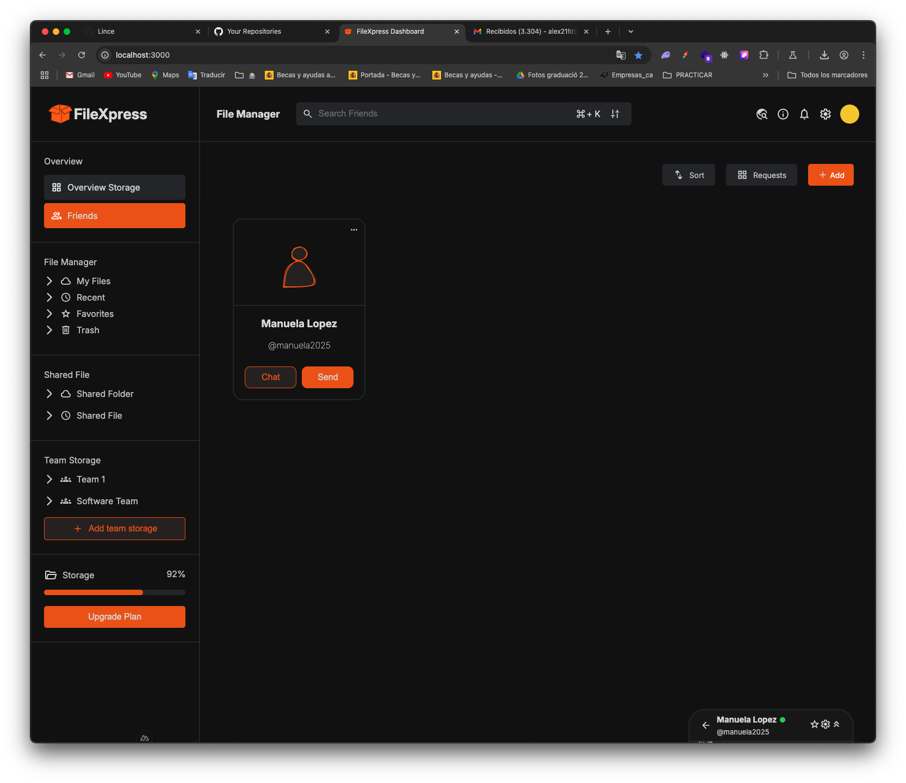
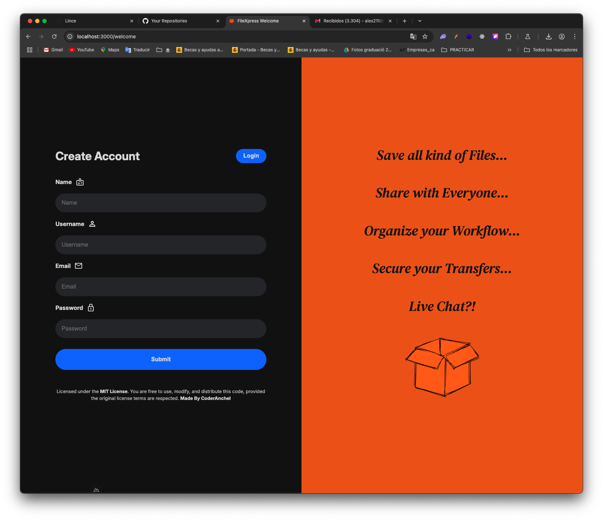
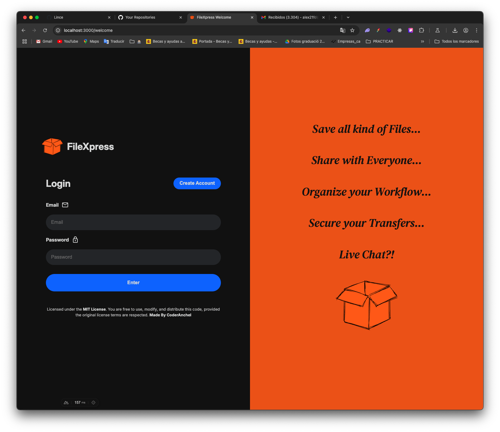
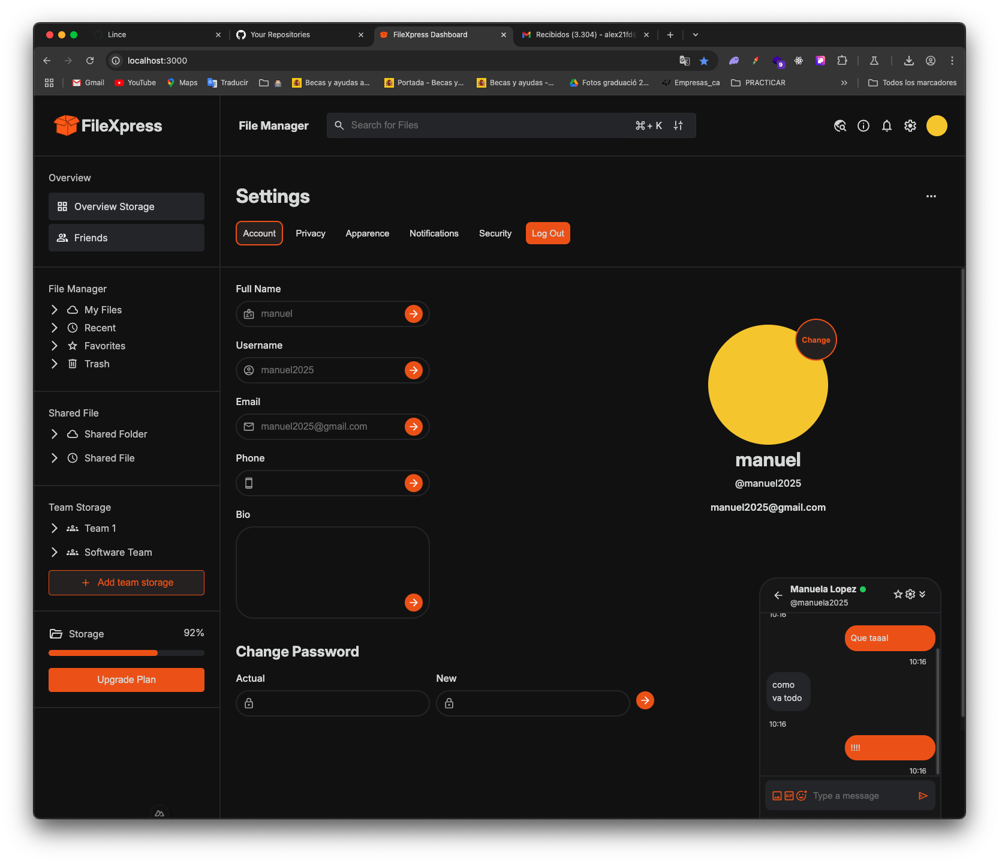
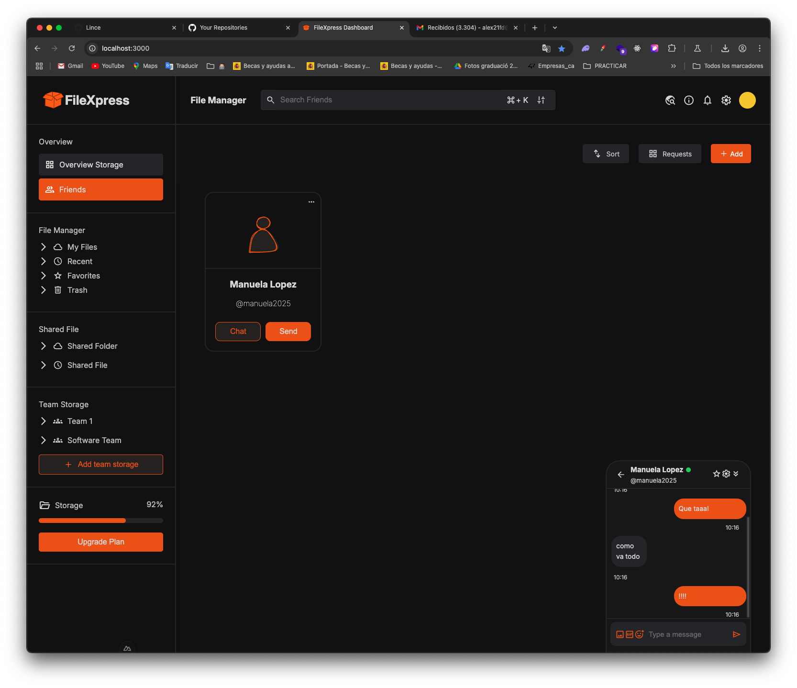

# FileXpress

FileXpress is a real-time file transfer system integrated with a chat feature. It is built using Java with Spring, RabbitMQ for message brokering, and WebSockets for handling sessions. The backend is secured with JWT, Cookies, and BCrypt for passwords. The frontend is developed with Nuxt.js, featuring a plain Vue.js UI with SCSS, Pinia, and Vue Toastification.

## Features

- Real-time file transfer
- Integrated chat feature
- Secure authentication with JWT and Cookies
- Password encryption with BCrypt
- Session management with WebSockets
- Responsive UI built with Vue.js and SCSS
- State management with Pinia
- Notifications with Vue Toastification

  

https://github.com/user-attachments/assets/41c88a36-9f99-49f2-a3c6-c56cfa289d37


## Installation

### Backend

1. Clone the repository:
    ```bash
    git clone https://github.com/CoderAnchel/FileXpress.git
    cd FileXpress
    ```

2. Set up the MySQL database and configure the connection in the `application.properties` file.

3. Build and run the backend:
    ```bash
    ./mvnw clean install
    ./mvnw spring-boot:run
    ```

### Frontend

1. Navigate to the frontend directory:
    ```bash
    cd frontend
    ```

2. Install the dependencies:
    ```bash
    npm install
    ```

3. Run the frontend development server:
    ```bash
    npm run dev
    ```

## Usage

1. Start the backend server.
2. Start the frontend development server.
3. Open your browser and navigate to `http://localhost:3000`.

## Technologies Used

- **Backend:**
  - Java with Spring
  - RabbitMQ
  - WebSockets
  - MySQL
  - JWT, Cookies, BCrypt

- **Frontend:**
  - Nuxt.js
  - Vue.js
  - SCSS
  - Pinia
  - Vue Toastificatio
## Screenshots and Assets
[Testing Video](assets/Test.mp4)






## Contributing

1. Fork the repository
2. Create your feature branch (`git checkout -b feature/AmazingFeature`)
3. Commit your changes (`git commit -m 'Add some AmazingFeature'`)
4. Push to the branch (`git push origin feature/AmazingFeature`)
5. Open a Pull Request

## License

Distributed under the MIT License. See `LICENSE` for more information.
